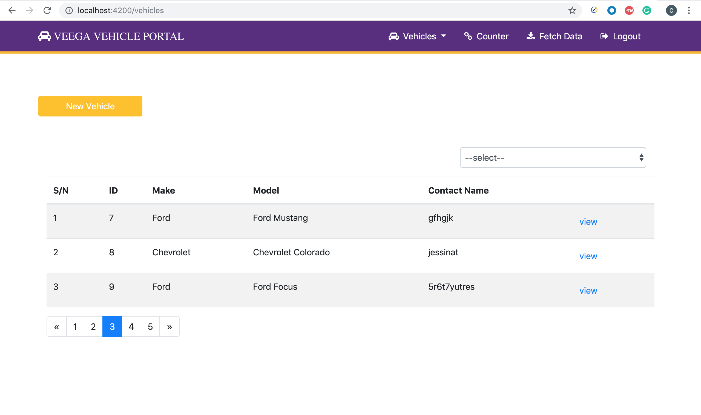

# Vehicle Management- App

This application is used to manage fleets of vehicle

# Table of Contents

- [Getting Started](#getting-started)
- [Technology Stack](#technology-stack)
- [Installation](#installation)
- [Instructions](#instructions)
- [Support or Contribution](#support-or-contribution)

## Getting Started
This is both server-side .Net and client-side javascript application built with [Angular](https://angular.io/) and [.NetCore](https://dotnet.microsoft.com/download). The database is [SQL Server](https://www.microsoft.com/en-us/sql-server/sql-server-downloads)

## Technology Stack

**Server Side**
1. .NetCore
2. SQL
3. EntityFramework Core

**Client Side**
1. Angular
2. AuthO

## Installation

1. Install [**Node JS**](https://nodejs.org/en/)
2. Install [Git](https://git-scm.com/downloads)
3. Install [Install SQL Database](http://www.sqlservertutorial.net/install-sql-server/)
4. Set up [Mongod](https://www.codecademy.com/articles/tdd-setup-mongodb-2)

## Instructions

**VS Code**
1. Clone the [**repository here**](https://github.com/syntiara/Vehicle-Management.git)
2. [**cd**] into the `ClientApp` directory of the **project directory**.
3. Run `npm run install` on the terminal to install project dependecies
4. Create an angular environment folder with prod and developemnt file in project root and define variables from        /VEEGA_APP/ClientApp/src/environments
5. Run `$ npm start` to start the application
6. Navigate to `localhost:4200` on your preferred browser

**Visual Studio** 

1. Open the project in visual studio
2. [**cd**] into the root of the **project directory**
3. run dotnet restore to restore package dependencies
4. Click run to start the project

**Database Setup**

- Create a `Database`
- Create the `tables` as the name appears in the `vehicle-management/core/entities`

**NetCore Setup**

- create an `appsettings.Development.json` file and define variables from `appsettings.sample.json`

**Auth0 Setup**

- Configure [AuthO](https://auth0.com/) to work with application
- Register with Auth0 to integrate authorization and authentication. You can create a free account.

- Read the [docs](https://auth0.com/docs/quickstart/spa/angular2) for setting it up 

## Support or Contribution
For any suggestions or contributions or issues please do raise them or email me.
For **Contributions**, Please clone the repo and implement a PR, I would appreciate it

